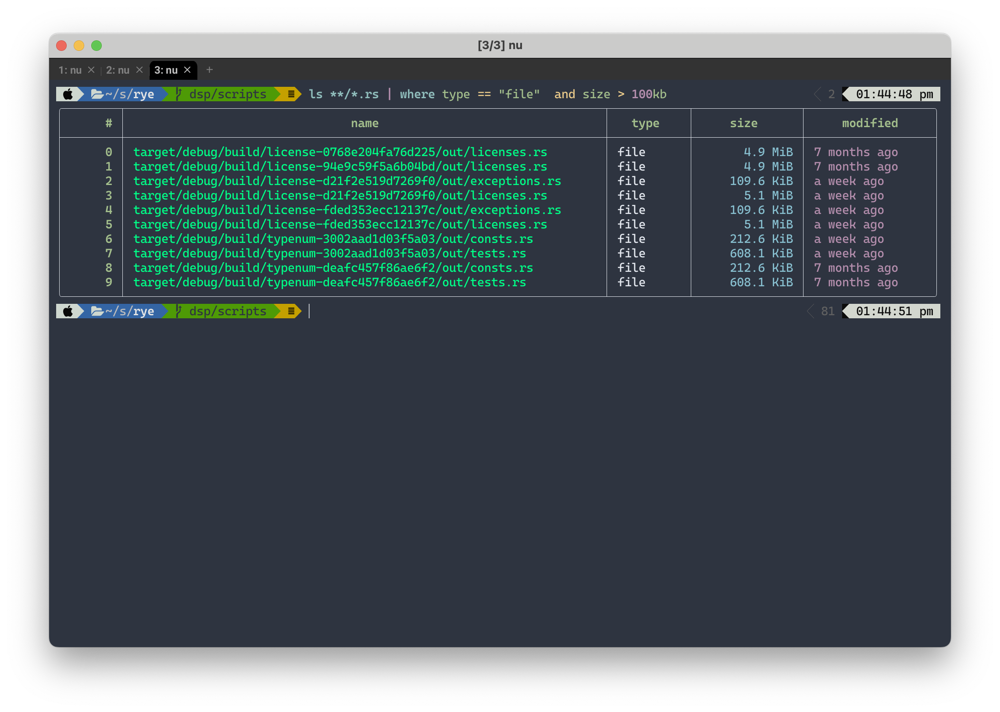
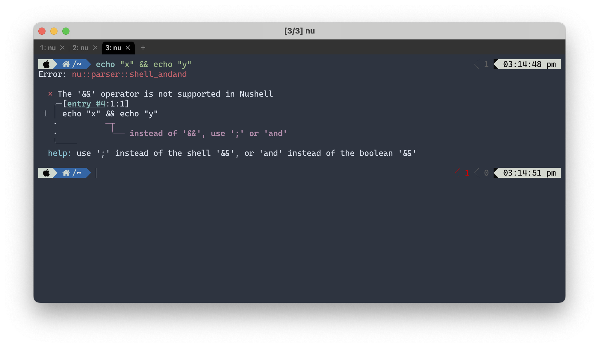

I don't like bash, I don't like zsh, but I am stuck with them. I tried [fish](https://fishshell.com/) and [oil](https://www.oilshell.org/), but somehow never got the hang of it (note... i should revisit them). So when I saw [pcwalton](https://twitter.com/pcwalton) playing around with yet another new shell, I was intrigued.

[nushell](https://nushell.sh) is one of the new shells around the block who aim to provide a much better experience over old established shells like [zsh](https://zsh.org) or [bash](https://www.gnu.org/software/bash/). The pitch is intriguing: Commands return structured data that is easy to query and modify. A new, easy to use shell language. Powerful plugins and a well established community.

For example, according to their website, you can do cool things like. 
```sh
> ls | where size > 10mb | sort-by modified
```


So on a Sunday, a few weeks ago, I installed `nushell` and set it as the default login shell on both my [NixOS](https://nixos.org) and my MacOS.

# Oh My...nushell
First things first, I made nushell a bit prettier. I found a a nice prompt in the [nu_scripts](https://github.com/nushell/nu_scripts/tree/main/modules/prompt) repository. I downloaded and installed some [nerdfonts](https://nerdfonts.com), and then typed `config env` to load my newly downloads prompt configuration.

Except...it didn't load. I was greeted with `cannot find column 'LAST_EXIT_CODE'`. Well, let's ask our [AI overlords](https://chat.openai.com) how to fix it and throw some `($env | get -i LAST_EXIT_CODE | is-empty) == true` into the mix and off we go:

## First impressions
My first impressions where quite positive. The structure data approached worked well for me in most scenarios and I enjoyed the ability to quickly combine filters. For most basic tasks, nushell was just okay and if anything a small improvement over bash. The syntax wasn't too hard to learn and the resources on the nushell website were good enough to quickly get used to using it.
## Where is my ... file?
I don't know where stuff is in my directories. I rely a lot on `find` or `fd`. I was super stoked to use `find` with some cool filters in nushell. Well it turns out there is no find command. I quickly realised, this is not the nushell way to think about a problem. After fiddling with it for a bit, I found a good way to query my files. I found it to be a great example of how to use the structured data approach. 

Imagine I want to find all `.rs` over a certain size files in a repository:
1. List everything matching the glob `*.rs`
2. Filter for only files using a [filter](https://www.nushell.sh/commands/categories/filters.html)
3. Filter for a certain size
This results in
``` sh
> ls **/*.rs | where type == "file" and size > 100kb 
```


Nice! I really liked that. It is quite intuitive and really shows the power. Arguable the `ls **/*` is a bit cumbersome, and I wish there was a `ls -r` or so instead, but those are nitpicks.

## Structured TOML, JSON, etc
One of the cool features of nushell is the ability to open structured file formats and interact with them on the shell. For example, running `open pyproject.toml`, gives you a visual representation of the toml file:

Of course, I can then go ahead and query it:

Neat! This also works with JSON and others.
## Complete all the things
I keep all my source code in `~/src`. I always wanted a fast way to switch to a project. It was a good task to see how easy it is to implement custom commands with nushell. The goal was simple: *Create a `p $name` command that switches to the project `$name`.*

I quickly headed over to my nushell config via `config nu` and wrote a short command:
```
module commands {
    export def --env p [name: string] {
        let thepath = "~/src/" + $name
        cd (if (echo $thepath | path exists) {
            echo $thepath
        } else {
            echo $env.PWD
        })
    }
}
```

This worked great, but I wanted to have autocompletion. It turns out nushell has a very easy mechanism to provide autocompletion. By adding an `@some-fn` to a type in the parameter list, you can completion via the given function. For example `export def --env p [name: string@p-complete]` will use `p-complete` to create completions. Implementing the complete function was easy enough:
```    
def p-complete [] {
        # List directories in ~/src
        ls ~/src
            | where type == "dir"
            | get name
            | where { |x| ($x + "/.git" | path exists ) or ($x + "/.sl" | path exists)}
            | path basename
    }
```

Now typing `$ p <TAB>` gives me a nice completion for little directory changer command `p`. That was easy, and cool. I really start to like nushell.
## Cope with Scope
If you took a careful look at `p`, you might notice an `--env`: 
```
    export def --env p [name: string] 
```

Nushell has some [strict scoping rules](https://www.nushell.sh/book/environment.html#scoping). Any environment variable inside the custom command will only exist inside the command's scope. You must specify `--env` in order to preserve env variables. It takes a bit use-to, but makes modification of environment variables explicit.

**Note**: Previous versions of the blog post contained criticism on scoping, which were unfounded.

## You had one job...
A common use-case for me is editing a file in `vim`, then using [`CTRL-Z`](https://neovim.io/doc/user/usr_21.html#21.1) to suspend vim, return to the command line, edit something and use `fg` to resume. It turns out, nushell [doesn't have job control](https://github.com/nushell/nushell/discussions/5948). If you hit `CTRL-Z` you get back the shell, but the shell just hangs. Well that's not good is it. I slowly try to retrain my habits and just exit vim, but every so often I get stuck. 

There are work arounds such as [job-security](https://github.com/yshui/job-security), but I really want this to be part of my shell. In fact, it's kinda of a deal breaker for me with nushell. 

## AND....
Another nushell annoyance (and by annoyance I say W - T - F out loud, every single time) is the lack of `&&` or `||` for commands. If you try to run `echo "x" && echo "y"` you will be greeted with: 

So nushell tells me to use `;` (ignore the `and` bit, that's for boolean operations only). That's great, but it's not the same as `&&`. I want to run the second command conditionally on the first. I want to run `x || echo "IT'S BORKED!'` in my scripts. I want to `c++ -o myprogram main.cpp && ./myprogram` all the time.

Of course , I can rewrite this as `if $env.LAST_EXIT_CODE != {...}` or `try { ... } catch { ... }` (see : [#7448](https://github.com/nushell/nushell/pull/7448), [#7452](https://github.com/nushell/nushell/pull/7452) and [#7479](https://github.com/nushell/nushell/issues/7479)), but that's very cumbersome on the command line. A shell language is about being concise.

There are a set of [open issues on github](https://github.com/nushell/nushell/issues/5740) about this, so I stay hopeful, but given the issue is open since 1.5 years, isn't very promising.
# Conclusion
I want to like nushell. In it's core, the ideas of using structure data are good. Some features such as `open` or built-in databases, are great. I always wanted these cool features in my shell. Writing new commands is easy and adding completion is very nice actually.

However, it is still lacking core features of a shell. For all it's bells and whistle nushell has, I think its core lacks fundamental features. Conditional execution of commands and job control are fairly basic things I need in a shell.

So now I am stuck. I really want to like nushell. It comes close to the shell I always wanted (okay, i really want a shell with a purely functional programming language, probably ocaml style, but hey...one can wish), but in the end, I can't shake the feeling that for all the cool stuff they are doing, they don't focus on the core of a shell.

I don't want to go back to bash and zsh, and yet I often have to.
